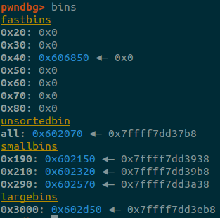
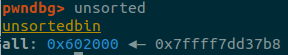
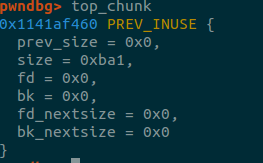
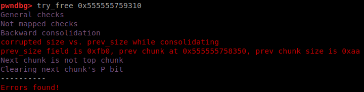
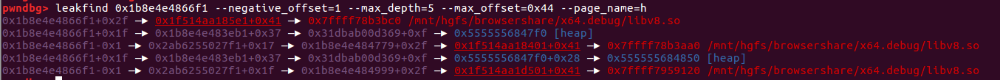

# pwndbg

Pwndbg has a great deal of useful features.  You can a list of all available commands at any time by typing the `pwndbg` command.  Here's a small subset which are easy to capture in screenshots.

## Arguments

All function call sites are annotated with the arguments to those functions.  This works best with debugging symbols, but also works in the most common case where an imported function (e.g. libc function via GOT or PLT) is used.

  
  
  
  
  
  

## Context

A useful summary of the current execution context is printed every time GDB stops (e.g. breakpoint or single-step), displaying all registers, the stack, call frames, disassembly, and additionally recursively dereferencing all pointers.  All memory addresses are color-coded to the type of memory they represent.

The output of the context may be redirected to a file (including other tty) by using `set context-output /path/to/file` while leaving other output in place.

  

### Splitting / Layouting Context

The context sections can be distributed among different tty by using the `contextoutput` command.
Example: `contextoutput stack /path/to/tty true`

Python can be used to create a tmux layout when starting pwndbg and distributing the context among
the splits.
```python
python
import atexit
import os
from pwndbg.commands.context import contextoutput, output, clear_screen
bt = os.popen('tmux split-window -P -F "#{pane_id}:#{pane_tty}" -d "cat -"').read().strip().split(":")
st = os.popen(F'tmux split-window -h -t {bt[0]} -P -F '+'"#{pane_id}:#{pane_tty}" -d "cat -"').read().strip().split(":")
re = os.popen(F'tmux split-window -h -t {st[0]} -P -F '+'"#{pane_id}:#{pane_tty}" -d "cat -"').read().strip().split(":")
di = os.popen('tmux split-window -h -P -F "#{pane_id}:#{pane_tty}" -d "cat -"').read().strip().split(":")
panes = dict(backtrace=bt, stack=st, regs=re, disasm=di)
for sec, p in panes.items():
  contextoutput(sec, p[1], True)
contextoutput("legend", di[1], True)
atexit.register(lambda: [os.popen(F"tmux kill-pane -t {p[0]}").read() for p in panes.values()])
end
```
If you like it simple, try configuration with [splitmind](https://github.com/jerdna-regeiz/splitmind)


Note above example uses splitmind and following configuration:

```python
python
import splitmind
(splitmind.Mind()
  .tell_splitter(show_titles=True)
  .tell_splitter(set_title="Main")
  .right(display="backtrace", size="25%")
  .above(of="main", display="disasm", size="80%", banner="top")
  .show("code", on="disasm", banner="none")
  .right(cmd='tty; tail -f /dev/null', size="65%", clearing=False)
  .tell_splitter(set_title='Input / Output')
  .above(display="stack", size="75%")
  .above(display="legend", size="25")
  .show("regs", on="legend")
  .below(of="backtrace", cmd="ipython", size="30%")
).build(nobanner=True)
end
```

### Watch Expressions

You can add expressions to be watched by the context.
Those expressions are evaluated and shown on every context refresh.

An expression can be added via the `contextwatch` command (aliased `ctx-watch` and `cwatch`).

Per default an expression is parsed and evaluated in the debugged language and can be added with:
```
contextwatch BUF
ctx-watch ITEMS[0]
```

Alternatively one can provide an arbitrary gdb command to be executed and the result printed in the
context by using the optional `cmd` parameter with the value `execute`:
```
contextwatch execute "ds BUF"
cwatch execute "x/20x $rsp"
```

### Ghidra

With the help of [radare2](https://github.com/radareorg/radare2) it is possible to show the
decompiled source code of the ghidra decompiler.

However, this comes with some prerequisites.
* First: you have to have installed radare2 and it must be found by gdb (within path)
* Second: you have to install the ghidra plugin for radare2
  [r2ghidra-dec](https://github.com/radareorg/r2ghidra-dec)
* Third: r2pipe has to be installed in the python-context gdb is using

The decompiled source be shown as part of the context by adding `ghidra` to `set context-sections`
or by calling `ctx-ghidra [function]` manually.

Be warned, the first call to radare2/r2ghidra-dec is rather slow! Subsequent requests for decompiled
source will be faster. And it does take up some resources as the radare2 instance is kept by r2pipe
to enable faster subsequent analysis.

With those performance penalties it is reasonable to not have it launch always. Therefore it includes
an option to only start it when required with `set context-ghidra`:
* `set context-ghidra always`: always trigger the ghidra context
* `set context-ghidra never`: never trigger the ghidra context except when called manually
* `set context-ghidra if-no-source`: invoke ghidra if no source code is available

Remark: the plugin tries to guess the correct current line and mark it with "-->", but it might
get it wrong.

## Disassembly

Pwndbg uses Capstone Engine to display disassembled instructions, but also leverages its introspection into the instruction to extract memory targets and condition codes.

All absolute jumps are folded away, only displaying relevant instructions.

  

Additionally, if the current instruction is conditional, Pwndbg displays whether or not it is evaluated with a green check or a red X, and folds away instructions as necessary.

  
  
  

## Emulation

Pwndbg leverages Unicorn Engine in order to only show instructions which will actually be emulated.  At each debugger stop (e.g. breakpoint or single-step) the next few instructions are silently emulated, and only instructions which will actually be executed are displayed.

This is incredibly useful when stepping through jump tables, PLT entries, and even while ROPping!

  
  
  

## Heap Inspection

Pwndbg enables introspection of the glibc allocator, ptmalloc2, via a handful of introspection functions.

  
  
  
  
  
  
  
  
  
  
  

  

## IDA Pro Integration

Pwndbg flips traditional IDA Pro integration on its head.  Rather than sticking code inside of IDA that you need to interact with, by installing a small [XMLRPC server](ida_script.py) inside of IDA, Pwndbg has full access to everything IDA knows.

This allows extraction of comments, decompiled lines of source, breakpoints, and synchronized debugging (single-steps update the cursor in IDA).

  
  
  

Since the complete IDA API is exposed, new tools can be built on this functionality to further enhance Pwndbg's usefulness.

You can also connect to Ida Pro XMLRPC server hosted on different machine. In order to achieve it, you need to change:
* Ida Pro XMLRPC server host (in [ida_script](ida_script.py); as by default it binds to localhost)
* The config parameters responsible for connection (see `config` command)

## Configuration, customization

There are two commands to set various options:

* `theme` - to set particular output color/style
  

* `config` - to set parameters like whether to emulate code near current instruction, ida rpc connection info, hexdump bytes/width (and more)
  

Of course you can generate and put it in `.gdbinit` after pwndbg initialization to keep it persistent between pwngdb sessions.

This can be seen and achieved by `configfile`/`themefile` commands.

## QEMU Compatibility

Pwndbg is designed to work with minimally-implemented or otherwise debugger-hostile implementations of the GDB Serial Protocol.  One such implementation is that used by QEMU User-Mode Emulation (`qemu-user`) which is frequently used by CTF players to execute and debug cross-architecture binaries.

Vanilla GDB, PEDA, and GEF all fail terribly in this scenario.

#### GEF

  

#### PEDA

  

#### Vanilla GDB

  

#### Pwndbg

However, Pwndbg works around the limitations of the GDB stub to give you the best debugger environment possible.

  

## Process State Inspection

Use the `procinfo` command in order to inspect the current process state, like UID, GID, Groups, SELinux context, and open file descriptors!  Pwndbg works particularly well with remote GDB debugging like with Android phones, which PEDA, GEF, and vanilla GDB choke on.

  

## ROP Gadgets

Pwndbg makes using ROPGadget easy with the actual addresses in the process.

Just use the `rop` command!

  

## Search

Pwndbg makes searching the target memory space easy, with a complete and easy-to-use interface.  Whether you're searching for bytes, strings, or various sizes of integer values or pointers, it's a simple command away.

  

## Finding Leaks

Finding leak chains can be done using the `leakfind` command. It recursively inspects address ranges for pointers, and reports on all pointers found.


## Telescope

Inspecting memory dumps is easy with the `telescope` command.  It recursively dereferences a range of memory, letting you see everything at once.  As an added bonus, Pwndbg checks all of the available registers to see if they point into the memory range.

## Virtual Memory Maps

Pwndbg enhances the standard memory map listing, and allows easy searching.

  
  
  
  
  

## Windbg Compatibility

Pwndbg has a complete windbg compatibility layer.  You can `dd`, `dps`, `eq`, and even `eb eip 90` to your heart's content.

  
