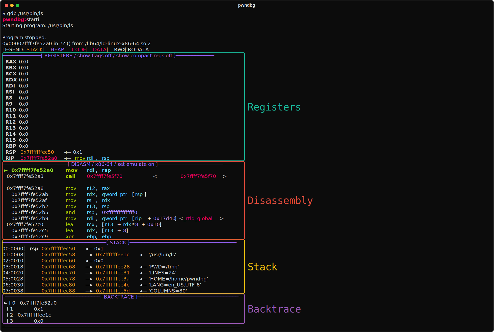
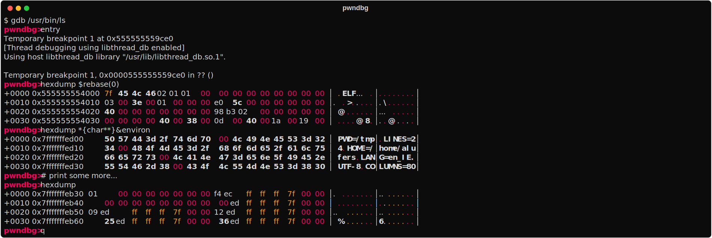
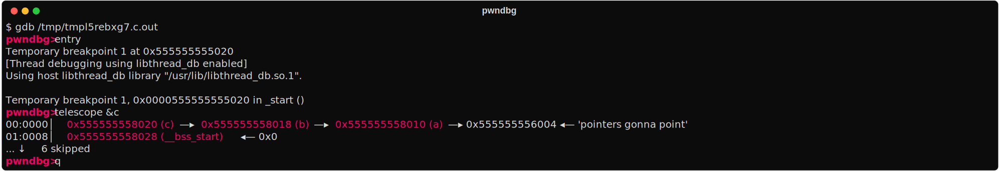
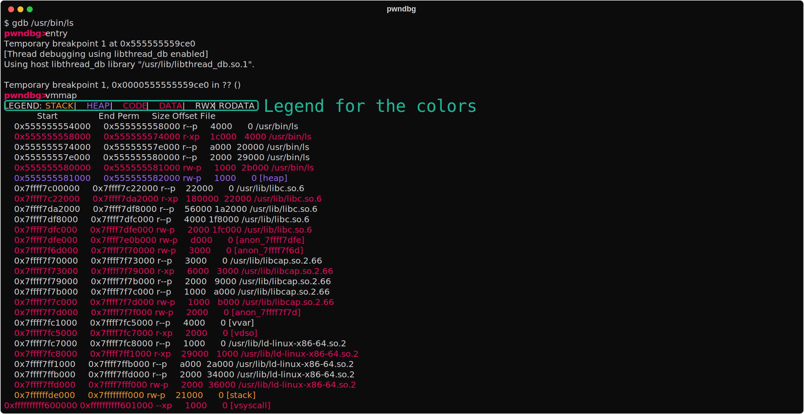
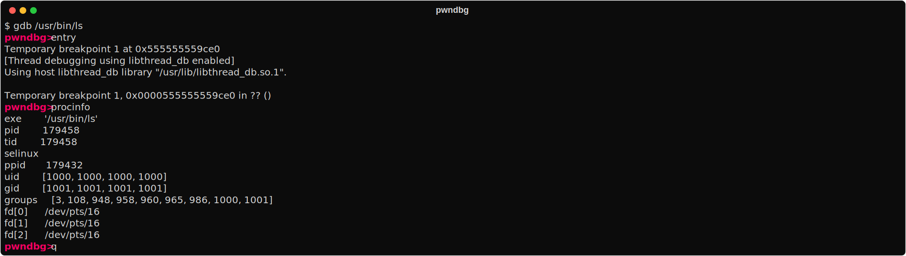
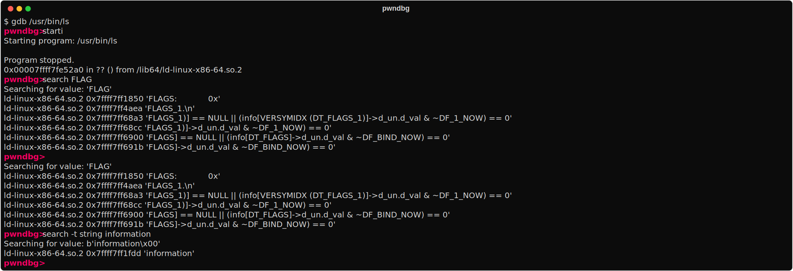
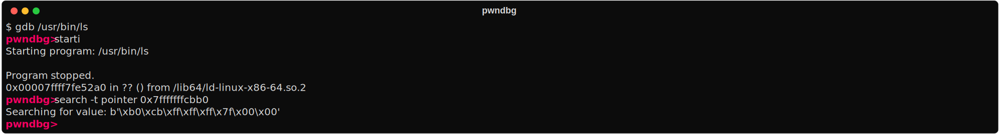
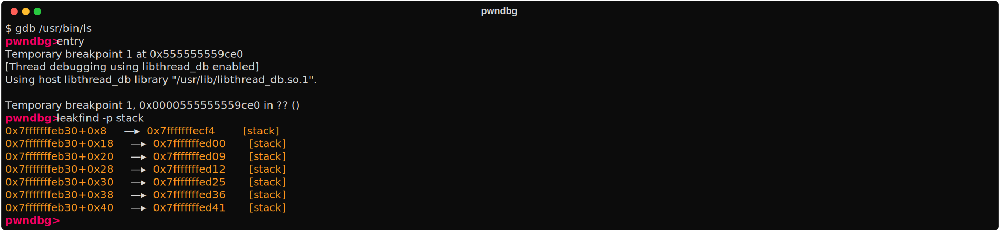

# pwndbg

Pwndbg has a great deal of useful features.  You can a list of all available commands at any time by typing the `pwndbg` command.  Here's a small subset which are easy to capture in screenshots.

## Context

An useful summary of the current execution context is printed every time GDB stops (e.g. breakpoint or single-step):



The context shows:
  - registers
  - the stack
  - call frames
  - disassembly
  - all pointers are recursively dereferenced

  TODO

## Commands

Most of the feature-set of pwngdb comes from commands that are added to gdb. A few of them are documented here, to see more run `pwndbg` inside of gdb to list all of the available commands.

### `hexdump`

This is one of the the key missing feature from GDB. `pwndbg` adds an easy way to print data as hexdumps. Just use `hexdump <address>` to print the data at that address.


### `telescope`

Telescope is an useful command for inspecting complex data structures, it recursively dereferences pointers and prints the data to which they point.

Consider this simple C program:

```c gcc -ggdb -o $BIN $IN
char *a = "pointers gonna point";
char **b = &a;
char ***c = &b;

int main() {}
// compile with:
// gcc -ggdb -o telescope_example telescope_example.c
```

Running `telescope` on the address of `c` will print the data to which `c` points, `b`, and the data to which `b` points, `a`.


### `vmmap`

This command prints the memory map of the current process.  It the data in a color-coded table. See the `LEGEND:` for the meaning of the colors.



### `procinfo`

Use the `procinfo` command in order to inspect the current process state, like UID, GID, Groups, SELinux context, and open file descriptors!  Pwndbg works particularly well with remote GDB debugging like with Android phones, which PEDA, GEF, and vanilla GDB choke on.


### `search`

Pwndbg makes searching the target memory space easy, with a complete and easy-to-use interface. Whether you're searching for bytes, strings, or various sizes of integer values or pointers, it's a simple command away.

Searching for strings in memory space with `search <string>` or with `search -t string <string>` (this will will include the null terminator in the search).


Searching for byte sequences `search <hex>`:


### `rop`

You can use the `rop` command to search for ROP gadgets in the current process with Jon Salwan's [ROPGadget](https://github.com/JonathanSalwan/ROPgadget) tool. This is useful for finding gadgets to use in ROP chains.


### `leakfind`

Finding leak chains can be done using the leakfind command. It recursively scans address ranges for pointers, and reports on all pointers found, recursively dereferencing them.


